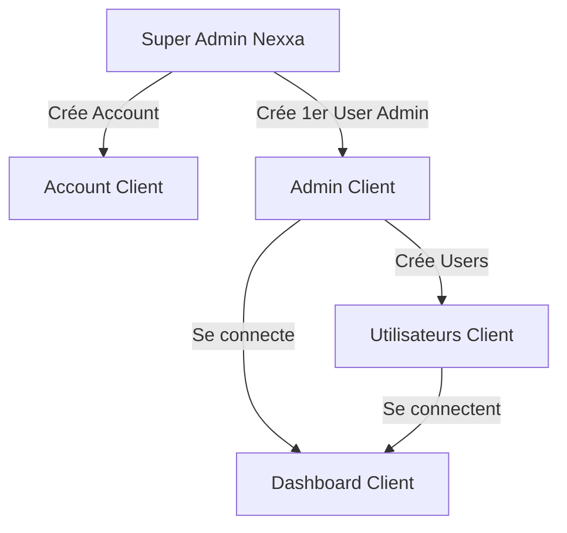

# Mode Invitation-Only

## Vue d'ensemble

L'application utilise un mode **invitation-only** pour la création de comptes. Il n'y a pas d'auto-inscription publique.

## Pourquoi Invitation-Only?

1. **Sécurité**: Pas d'auto-signup malveillant
2. **Contrôle**: Les admins provisionnent tous les comptes
3. **B2B**: Chaque client doit être validé avant activation
4. **Multi-tenant**: Isolation des données garantie dès la création

## Processus de Création de Compte

### 1. Création d'Account (par Super Admin Nexxa)

Les admins Nexxa créent d'abord un Account pour chaque client:

```typescript
// Via Prisma ou script seed
await prisma.account.create({
  data: {
    name: 'Client Name',
    isDemo: false,
    features: {
      inbox: true,
      crm: true,
      analytics: true,
      channels: true,
      calendar: true,
      alerts: true
    }
  }
});
```

### 2. Création d'Utilisateur Admin Client (par Super Admin Nexxa)

Utiliser l'API admin pour créer le premier utilisateur du client:

```bash
POST /api/admin/users
Authorization: Bearer <NEXXA_ADMIN_TOKEN>

{
  "username": "client.admin",
  "email": "admin@client.com",
  "password": "SecurePassword123!",
  "name": "Client Admin",
  "role": "ADMIN"
}
```

**Note**: L'admin Nexxa doit:
1. Se connecter avec `valentinmilliand.nexxa` ou `nexxa.admin`
2. Utiliser le token JWT pour authentifier la requête
3. Fournir un mot de passe sécurisé au client

### 3. Création d'Utilisateurs Supplémentaires (par Admin Client)

Une fois le compte client créé, l'admin du client peut créer des utilisateurs:

```bash
POST /api/admin/users
Authorization: Bearer <CLIENT_ADMIN_TOKEN>

{
  "username": "john.doe.client",
  "email": "john.doe@client.com",
  "password": "SecurePassword123!",
  "name": "John Doe",
  "role": "USER"
}
```

## Endpoints Désactivés

- `POST /api/auth/register` - **DÉSACTIVÉ** (commenté dans auth.controller.ts)
- Route frontend `/account/register` - **DÉSACTIVÉE** (non publique, redirige vers login)

## Endpoints Actifs

### Pour Création d'Utilisateurs (Admin Only)
- `POST /api/admin/users` - Créer un utilisateur
- `GET /api/admin/users` - Lister les utilisateurs du compte
- `GET /api/admin/users/:id` - Voir un utilisateur
- `PUT /api/admin/users/:id` - Modifier un utilisateur
- `DELETE /api/admin/users/:id` - Supprimer un utilisateur

### Pour Authentification (Public)
- `POST /api/auth/login` - Se connecter
- `POST /api/auth/refresh` - Rafraîchir le token
- `POST /api/auth/magic-link` - Demander un lien magique
- `GET /api/auth/magic-link/verify` - Vérifier un lien magique
- `GET /api/auth/google` - OAuth Google
- `GET /api/auth/me` - Obtenir l'utilisateur courant

## Impact UI

### Pages Disponibles (Non Authentifié)
- `/[locale]/account/login` - Page de connexion

### Pages Protégées (Authentification Requise)
- `/[locale]/inbox` - Boîte de réception
- `/[locale]/alerts` - Alertes
- `/[locale]/analytics` - Analytiques
- `/[locale]/calendar` - Calendrier
- `/[locale]/crm` - CRM
- `/[locale]/settings` - Paramètres

### Pages Supprimées
- `/[locale]/account/register` - **SUPPRIMÉE**

## Flux de Travail Complet



## Comptes Existants

### Super Admins Nexxa
- `valentinmilliand.nexxa` (ADMIN)
- `nexxa.admin` (ADMIN)
- `nexxa.demo` (ADMIN - compte de test)

### Clients
- `goodlife.nexxaagents` (USER - GoodLife account)

## Notes de Sécurité

1. **Mots de passe**: Minimum 8 caractères requis
2. **Tokens**: JWT 15min (access) + 7 jours (refresh)
3. **Isolation**: Chaque user appartient à un seul Account
4. **RBAC**: ADMIN peut gérer users, USER peut seulement utiliser l'app
5. **Validation**: Username unique par account, email optionnel
